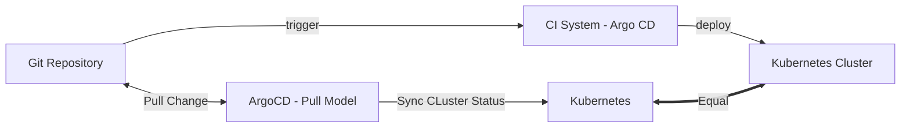

# test-infra

An comprehensive for argocd and deployment flow



---

### Start argocd local

```bash
# create ns
kubectl create ns argocd

# install by manifest file
kubectl apply -n argocd -f https://raw.githubusercontent.com/argoproj/argo-cd/stable/manifests/install.yaml

# get credentials
kubectl -n argocd get secret argocd-initial-admin-secret -o jsonpath="{.data.password}" | base64 -d; echo

```

---

### Access to Pod

```bash

```
